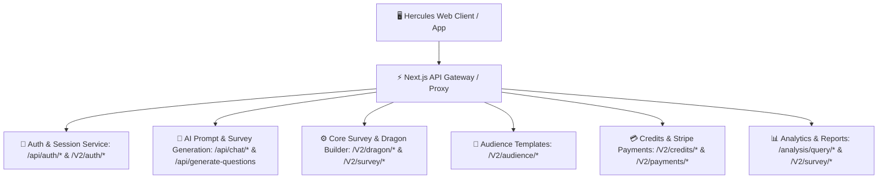

# 📡 Hercules B2B Platform — Master API Endpoint Catalog

> **Target Platform**: `https://dev.hercules.works`  
> **Source Configuration**: [`config/herculesEndpoints.js`](config/herculesEndpoints.js)  
> **Safety Guard**: Non-destructive test isolation policy active (`ScopeGuard.js`).  

---

## 📑 API Architecture Breakdown

---

## 1. 🔑 Authentication & Identity Management

| Route Key | Endpoint | HTTP Method(s) | Description / Function |
| :--- | :--- | :--- | :--- |
| `LOGIN` | `/api/login` | `POST` | Core user login entrypoint |
| `LOGOUT` | `/api/logout` | `POST` | User logout and session invalidation |
| `SYNC` | `/api/auth/sync` | `POST` | Session token & user state synchronization |
| `CLEAR_COOKIES` | `/api/auth/clear-cookies` | `POST` | Invalidate and clear auth cookies |
| `SIGNUP_OTP` | `/api/auth/send-verification-otp` | `POST` | Dispatches email verification link / OTP |
| `VERIFY_OTP` | `/api/auth/verify-otp-and-signup` | `POST` | Confirms email verification & creates account |
| `PASSWORD_LOGIN` | `/V2/auth/pwd-login` | `POST` | Direct password authentication |
| `PASSWORD_LOGIN_VERIFY` | `/V2/auth/pwd-login/verify` | `POST` | Password login two-step verification |
| `PASSWORD_LOGIN_ACCOUNT_STATUS` | `/V2/auth/pwd-login/account-status` | `GET` | Checks user account activation status |
| `FORGOT_PASSWORD_EMAIL` | `/V2/auth/fpwd/send-email` | `POST` | Triggers password reset email |
| `FORGOT_PASSWORD_VERIFY` | `/V2/auth/fpwd/verify` | `POST` | Verifies password reset link |
| `RESET_PASSWORD_OTP` | `/api/auth/forgot-password/send-otp` | `POST` | Sends OTP for password reset |
| `RESET_PASSWORD_VERIFY_OTP` | `/api/auth/forgot-password/verify-otp` | `POST` | Validates password reset OTP |
| `RESET_NEW_PASSWORD` | `/api/auth/forgot-password/reset` | `POST` | Commits newly created password |
| `GOOGLE_LOGIN` | `/api/auth/google/code-exchange` | `POST` | Exchanges Google OAuth authorization code |
| `GOOGLE_TOKEN` | `/api/auth/google/get-access-token` | `POST` | Fetches Google OAuth access token |
| `GOOGLE_LINK` | `/V2/auth/google/id-token-auth` | `POST` | Links Google identity to account |
| `TOKEN_LOGIN` | `/V2/auth/token-login/:token` | `GET` | One-click magic token login |
| `CLAIM_GUEST_SESSION` | `/api/chat/claim-guest-session` | `POST` | Associates anonymous guest chats to signed-in user |

---

## 2. 🧠 AI Workspace & Chat Stream Engine

| Route Key | Endpoint | HTTP Method(s) | Description / Function |
| :--- | :--- | :--- | :--- |
| `SUGGESTIONS` | `/api/prompt-suggestions` | `GET` | Contextual research prompt recommendations |
| `CHAT` | `/api/chat` | `POST` | Sends natural language research prompt |
| `CHAT_STREAM` | `/api/chat/stream` | `POST` | SSE stream for real-time AI response tokens |
| `CHAT_STREAM_RESUME` | `/api/chat/stream/resume` | `POST` | Resumes interrupted SSE chat stream |
| `RETRY_PROMPT` | `/api/chat/retry` | `POST` | Retries failed AI generation turn |
| `RETRY_PROMPT_STREAM` | `/api/chat/retry/stream` | `POST` | Retries streaming generation turn |
| `CANCEL_REQUEST` | `/api/cancel-request` | `POST` | Aborts ongoing AI generation inference |
| `DIRECT_FLOW` | `/api/directflow` | `POST` | Executes direct automated survey pipeline |
| `DRAFT_DIRECT_FLOW` | `/api/draftdirectflow` | `POST` | Saves survey pipeline draft |
| `EXECUTE_DIRECT_FLOW` | `/api/executedirectflow` | `POST` | Finalizes direct automated deployment |
| `GUEST_CHATS` | `/api/guest_chats` | `GET` | Retrieves unauthenticated guest session chats |

---

## 3. 📝 Survey Lifecycle & Questionnaire Refinement

| Route Key | Endpoint | HTTP Method(s) | Description / Function |
| :--- | :--- | :--- | :--- |
| `GENERATE_QUESTIONS` | `/api/generate-questions` | `POST` | Generates initial questionnaire questions |
| `REFINE_SURVEY` | `/api/refine-survey` | `POST` | Refines question phrasing, choices, and logic |
| `REGISTER_ALL_QUESTIONS`| `/api/register-all-questions`| `POST` | Commits generated question tree to database |
| `FINALIZE_SURVEY` | `/api/finalize-survey` | `POST` | Finalizes questionnaire structure for deployment |
| `DEPLOY_SURVEY_VERSION` | `/api/deploy-survey-version` | `POST` | Deploys active survey version to consumer pool |
| `DEPLOY_SURVEY_INTERNAL`| `/V2/survey/deploy-internal` | `POST` | Internal deployment for testing/QA |
| `GET_DEPLOYED_VERSION` | `/api/chats/:id/version/:ver/deployed-payload` | `GET` | Fetches deployed JSON survey payload |
| `GET_SURVEY_DETAILS` | `/V2/survey/details` | `GET` | Fetches metadata for specific survey ID |
| `UPDATE_SURVEY` | `/V2/dashboard/update-survey`| `PATCH` | Updates survey configuration & settings |
| `UPDATE_AI_SURVEY` | `/V2/survey/user/update-ai-survey` | `PATCH` | Updates AI-generated questionnaire schema |
| `SYNC_EDITS` | `/api/survey/sync-edits` | `POST` | Synchronizes user edits across questions |
| `EDIT_QUESTION_MOBILE` | `/api/survey/edit-question` | `POST` | Question editor for mobile clients |
| `LOOKUP_CHAT_IDS` | `/api/surveys/lookup-chat-ids` | `POST` | Maps survey IDs to parent chat thread IDs |
| `SURVEY_INFO` | `/api/surveys/info` | `GET` | Overview statistics and question summary |
| `SEARCH_SURVEY` | `/V2/dashboard/survey_search` | `GET` | Searches surveys by ID, title, or email |

---

## 4. 💬 Chat History & Campaign Management

| Route Key | Endpoint | HTTP Method(s) | Description / Function |
| :--- | :--- | :--- | :--- |
| `GET_HISTORY` | `/api/chats` | `GET` | Fetches user's active survey campaigns |
| `DELETE_BULK` | `/api/chats/bulk` | `DELETE` | Bulk deletion of multiple campaign threads |
| `GET_CHAT_BY_ID` | `/api/chats/:id` | `GET` | Retrieves full chat thread and survey slides |
| `RENAME_CHAT` | `/api/chats/:id/rename` | `PATCH` | Renames survey / chat thread title |
| `STAR_CHAT` | `/api/chats/:id/star` | `PATCH` | Stars or unstars a campaign in the sidebar |
| `DUPLICATE_CHAT` | `/api/chats/:id/duplicate` | `POST` | Creates clone of existing survey campaign |
| `SHARE_CHAT` | `/api/chats/:id/share` | `POST` | Generates public / team shareable preview link |
| `CANCEL_EDIT_CHAT` | `/api/chats/:id/cancel-review` | `POST` | Discards draft changes during review |
| `RE_EDIT_CHAT` | `/api/chats/:id/re-edit` | `POST` | Re-opens deployed campaign for modifications |
| `EXPLAIN_DATA` | `/api/chats/:id/explain` | `GET` | AI explanation of survey results / chart data |
| `MARK_AUDIENCE_REVIEWED`| `/api/chats/:id/mark-audience-reviewed` | `POST` | Flags audience targeting step as verified |
| `GET_SHARE_TURN` | `/api/chat/:chatId/turn/:turnId` | `GET` | Fetches specific conversation turn for sharing |

---

## 5. 🐉 Dragon Question Builder & Media Injection

| Route Key | Endpoint | HTTP Method(s) | Description / Function |
| :--- | :--- | :--- | :--- |
| `CREATE_MCQ` | `/V2/dragon/create-mcq-question` | `POST` | Adds multiple-choice question card |
| `EDIT_MCQ` | `/V2/dragon/edit-mcq-question` | `PATCH` | Updates multiple-choice choices & prompt |
| `CREATE_QUESTIONS` | `/V2/dragon/create-questions` | `POST` | Batch creation of Dragon questions |
| `UPDATE_QUESTIONS` | `/V2/dragon/update-questions` | `PATCH` | Batch updates across question cards |
| `EDIT_QUESTIONS` | `/V2/dragon/edit-questions` | `PATCH` | Detailed edit of question properties |
| `GET_ALL_QUESTIONS` | `/V2/survey/get-all-questions?surveyId=:id` | `GET` | Retrieves all questions in structured JSON |
| `GET_CITY_LIST` | `/V2/dragon/city-list` | `GET` | Target city dataset for demographic questions |
| `INJECT_MEDIA` | `/api/chats/:id/inject-media`| `POST` | Attaches image/audio/video to question slide |
| `UPLOAD_MEDIA` | `/V2/answer/get-signed-url` | `POST` | Generates GCS signed URL for media upload |
| `VALIDATE_MEDIA` | `/api/media/validate` | `POST` | Verifies uploaded media format and size |

---

## 6. 👥 Audience Templates & Demographic Targeting

| Route Key | Endpoint | HTTP Method(s) | Description / Function |
| :--- | :--- | :--- | :--- |
| `CREATE` | `/V2/audience/create` | `POST` | Creates custom audience profile template |
| `DELETE` | `/V2/audience/delete-template` | `DELETE` | Removes custom audience template |
| `DUPLICATE` | `/V2/audience/duplicate` | `POST` | Duplicates existing audience criteria |
| `RENAME` | `/V2/audience/update-title` | `PATCH` | Updates audience template name |
| `GET_DEFAULT` | `/V2/audience/default-templates`| `GET` | System default demographic templates |
| `GET_PUBLIC_DEFAULT` | `/V2/public/audience/default-templates` | `GET` | Public unauthenticated demographic presets |
| `GET_MY_TEMPLATES` | `/V2/audience/my-templates` | `GET` | Saved user audience templates |
| `GET_SURVEY_AUDIENCE` | `/V2/audience/get?surveyId=:id` | `GET` | Active audience parameters for survey |
| `GET_USER_TEMPLATE` | `/V2/audience/template` | `GET` | Fetches specific user template configuration |
| `BULK_REPORTS` | `/V2/audience/reports` | `GET` | Multi-survey audience demographic breakdown |

---

## 7. 🔀 Survey Logic & Conditional Branching

| Route Key | Endpoint | HTTP Method(s) | Description / Function |
| :--- | :--- | :--- | :--- |
| `EDIT_ROUTES` | `/api/survey/edit-routes` | `POST` | Updates skip, branching, and redirect logics |
| `RESET_TURN` | `/api/survey/reset-survey-turn` | `POST` | Resets logic rules to default sequential flow |
| `GET_VERSIONS` | `/api/survey/logic-versions/:chatId/:turn` | `GET` | Lists historical versions of survey logics |
| `VIEW_VERSION` | `/api/survey/logic-versions/:chatId/:turn/:ver` | `GET` | Inspects specific logic version rulebook |
| `REVERSE_QUESTIONS_SYNC` | `/api/chats/:id/sync` | `POST` | Re-syncs question ordering from editor |
| `REVERSE_AUDIENCE_SYNC` | `/api/chats/:id/audience` | `POST` | Re-syncs audience criteria from editor |

---

## 8. 💳 Credits, Pricing & Stripe Subscriptions

| Route Key | Endpoint | HTTP Method(s) | Description / Function |
| :--- | :--- | :--- | :--- |
| `PRICING_DETAILS` | `/V2/credits/pricing` | `GET` | Pricing tiers and credit package rates |
| `GET_PRICING_PLANS` | `/V2/payments/get-pricing` | `GET` | Public subscription plan offerings |
| `ACCOUNT_CREDITS` | `/V2/credits/account` | `GET` | Current organization credit balance |
| `CHECK_BALANCE` | `/V2/credits/balance` | `GET` | Quick credit balance healthcheck |
| `ESTIMATE_COST` | `/V2/credits/estimate` | `POST` | Calculates survey cost by audience sample size |
| `DEDUCT_CREDITS` | `/V2/credits/deduct` | `POST` | Deducts credits upon campaign launch |
| `REVERSE_TRANSACTION` | `/V2/credits/reverse_transcations` | `POST` | Refunds credits on cancelled/rejected campaign |
| `UPGRADE_PLAN` | `/V2/credits/subscription/upgrade` | `POST` | Upgrades subscription (Starter, Pro, Enterprise) |
| `GET_SUBSCRIPTION` | `/V2/credits/subscription` | `GET` | Active subscription details & renewal date |
| `CREATE_ORDER` | `/V2/payments/create-order` | `POST` | Initiates Stripe checkout session / order |
| `VERIFY_PAYMENT` | `/V2/payments/verify` | `POST` | Webhook verification of completed Stripe payment |
| `GET_INVOICE` | `/V2/payments/invoice` | `GET` | Generates PDF invoice for past transactions |
| `PAYMENT_HISTORY` | `/V2/payments/history` | `GET` | Paginated transaction history |
| `SURVEY_PAYMENT_HISTORY`| `/V2/payments/survey-history/:id` | `GET` | Payment logs associated with specific survey |

---

## 9. 📊 Analytics, Reports & PDF Export

| Route Key | Endpoint | HTTP Method(s) | Description / Function |
| :--- | :--- | :--- | :--- |
| `AUDIENCE_INSIGHTS` | `/V2/audience/report/:surveyId` | `GET` | Demographic distribution of respondents |
| `PUBLIC_AUDIENCE_INSIGHTS` | `/V2/public/audience/report/:surveyId` | `GET` | Public shareable audience charts |
| `QUESTION_ANALYTICS` | `/V2/survey/get-question-report` | `GET` | Per-question response breakdown & charts |
| `BULK_QUESTION_REPORTS` | `/V2/survey/get-bulk-questions-report/:id` | `GET` | Aggregate responses across all questions |
| `DOWNLOAD_RESPONSES_REPORT` | `/V2/survey/get-responses-report/:id` | `GET` | Raw CSV/Excel export of respondent data |
| `DOWNLOAD_REPORT` | `/download/pdf` | `GET` | Generates PDF research report |
| `ANALYSIS_QUERY` | `/analysis/query/:id` | `POST` | Natural language query against survey data |
| `ANALYSIS_QUERY_STREAM` | `/analysis/query/stream/:id` | `POST` | Streaming data analyst query response |

---

## 10. 👤 Account & Organization Settings

| Route Key | Endpoint | HTTP Method(s) | Description / Function |
| :--- | :--- | :--- | :--- |
| `GET_DETAILS` | `/V2/account/details` | `GET` | User profile & company info |
| `UPDATE_DETAILS` | `/V2/account/update-details` | `PATCH` | Updates name, company, and industry |
| `DELETE_ACCOUNT` | `/V2/account/delete` | `POST` | Account deactivation request |
| `DELETE_USER` | `/api/users/me` | `DELETE` | Immediate user deletion |
| `GET_PROFILE_PIC` | `/V2/auth/get-profile-pic/:businessId` | `GET` | Fetches business avatar / logo |
| `SEND_EMAIL` | `/V2/contact/research-assistant` | `POST` | Inquiries to dedicated research assistant |
| `REQUEST_CONSULTATION`| `/V2/contact/consultation` | `POST` | Requests expert consultation |

---

## 11. 🛡️ Admin & Governance

| Route Key | Endpoint | HTTP Method(s) | Description / Function |
| :--- | :--- | :--- | :--- |
| `SYNC_SURVEY_STATUS` | `/api/admin/update-status` | `POST` | Admin approval / rejection of campaigns |
| `UPDATE_STATUS_ADMIN` | `/V2/survey/admin/update-ai-survey` | `PATCH` | Modifies survey lifecycle state |
| `GET_ADMIN_SURVEYS` | `/V2/dashboard/admin-surveys` | `GET` | Paginated admin survey moderation queue |
| `SUPERADMIN_ANALYTICS`| `/api/admin/superadmin/users/analytics` | `GET` | System-wide usage and tenant analytics |

---

### 🛡️ Non-Destructive Testing Policy:
* All automated tests (DAST, BOLA, SQLi, Session Security) strictly use **disposable Mailosaur test identities**.
* Destructive endpoints (`DELETE_USER`, `DELETE_ACCOUNT`, `DELETE_HISTORY`) are **never executed against production or shared datasets**.
