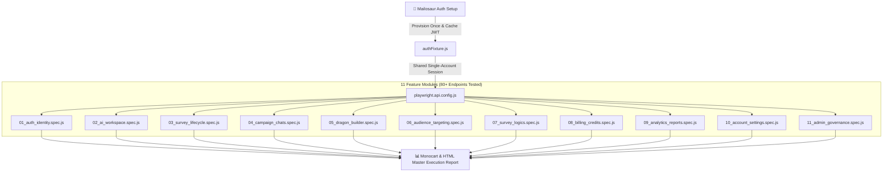

# 🚀 Hercules API Testing Framework

A dedicated, production-grade automated API testing framework engineered with **Playwright API Request Fixtures** to systematically test all **80+ official backend and gateway endpoints** of the Hercules B2B platform (`https://dev.hercules.works`).

---

## 🎯 Architecture & Single-Account Tracking



---

## 📋 Test Modules & Endpoint Coverage

1. **`01_auth_identity.spec.js`**:
   - `POST /api/auth/sync`, `GET /V2/auth/pwd-login/account-status`, `POST /api/auth/send-verification-otp`
   - Negative: Missing auth headers (`401`), invalid credentials (`400/401`), expired magic tokens (`400/404`).

2. **`02_ai_workspace.spec.js`**:
   - `GET /api/prompt-suggestions`, `POST /api/chat`, `GET /api/guest_chats`
   - Negative: Empty prompts, invalid chat turns, malformed direct flow pipelines.

3. **`03_survey_lifecycle.spec.js`**:
   - `POST /api/generate-questions`, `POST /api/surveys/lookup-chat-ids`, `GET /V2/dashboard/survey_search`
   - Negative: Querying non-existent survey IDs (`404`), missing deployment schemas.

4. **`04_campaign_chats.spec.js`**:
   - `GET /api/chats`, `GET /api/chats/:id`
   - Negative: Star/Rename non-existent chats, duplicate missing campaigns, empty bulk deletion.

5. **`05_dragon_builder.spec.js`**:
   - `GET /V2/dragon/city-list`, `GET /V2/survey/get-all-questions`
   - Negative: MCQ questions with missing choices, invalid question IDs, missing media injection URLs.

6. **`06_audience_targeting.spec.js`**:
   - `GET /V2/audience/default-templates`, `GET /V2/public/audience/default-templates`, `GET /V2/audience/my-templates`
   - Negative: Empty audience criteria, deleting missing template IDs.

7. **`07_survey_logics.spec.js`**:
   - `GET /api/survey/logic-versions/:chatId/:turn`
   - Negative: Empty routing rulebooks, resetting turn on fake chat IDs.

8. **`08_billing_credits.spec.js`**:
   - `GET /V2/credits/pricing`, `GET /V2/payments/get-pricing`, `GET /V2/credits/balance`, `GET /V2/credits/subscription`
   - Negative: Negative sample size cost estimation, deducting credits on invalid survey IDs, invalid payment signatures.

9. **`09_analytics_reports.spec.js`**:
   - `GET /V2/public/audience/report/:id`, `GET /V2/survey/get-question-report`
   - Negative: Downloading response reports for non-existent surveys, empty natural language queries.

10. **`10_account_settings.spec.js`**:
    - `GET /V2/account/details`, `GET /V2/auth/get-profile-pic/:id`
    - Negative: Empty user name updates, malformed consultation contact data.

11. **`11_admin_governance.spec.js`**:
    - `GET /V2/dashboard/admin-surveys`
    - Negative: Modifying survey moderation status or accessing superadmin analytics without root privileges (`401/403`).

---

## 🚀 How to Run

### Run All API Tests:
```bash
npm run test:hercules-api
```

### Run a Single Module:
```bash
npx playwright test Hercules_API_Testing/tests/08_billing_credits.spec.js --config=Hercules_API_Testing/playwright.api.config.js
```

### View Reports:
* **Monocart Report**: `Hercules_API_Testing/reports/hercules-api-report.html`
* **Playwright HTML Report**: `Hercules_API_Testing/reports/html-report/index.html`
