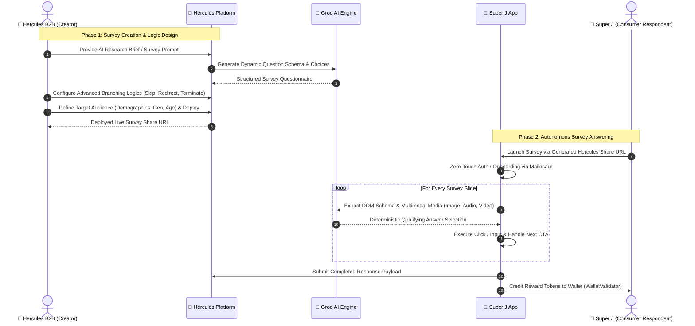

# Hercules & Super J — E2E Automation & Security Verification Suite

[](https://playwright.dev/)
[](https://nodejs.org/)
[](.github/workflows/security-ci.yml)
[](#-target-scoping--authorization-guard)

An enterprise-grade test automation and automated security verification suite designed for **Hercules B2B (Creator Platform)** and **Super J (Consumer Respondent App)**.

The framework provides two primary test capabilities:
1. **Autonomous E2E Survey Automation**: AI-driven closed-loop survey creation on Hercules B2B, logic configuration, and multimodal respondent answering on Super J.
2. **Automated DAST & API Security Regression**: Continuous verification of transport security, OWASP Top 10 baselines, multi-vector SQLi/SSRF probes, multi-tenant authorization (BOLA/IDOR), rate limiting, and JWT cryptography.

---

## 📑 Table of Contents

- [🔄 End-to-End Survey Lifecycle (Hercules B2B ➔ Super J)](#-end-to-end-survey-lifecycle-hercules-b2b--super-j)
- [🤖 Autonomous AI Answering & Multimodal Engine](#-autonomous-ai-answering--multimodal-engine)
- [🛡️ Automated Security & DAST Testing Framework](#️-automated-security--dast-testing-framework)
  - [Security Testing Engines](#security-testing-engines)
  - [Target Scoping & Authorization Guard](#-target-scoping--authorization-guard)
  - [Triage & Accepted Risk Suppressions](#-triage--accepted-risk-suppressions)
  - [CI/CD Quality Gate & Execution](#-cicd-quality-gate--execution)
- [🧰 Project Architecture](#-project-architecture)
- [🚀 Quick Start & CLI Reference](#-quick-start--cli-reference)

---

## 🔄 End-to-End Survey Lifecycle (Hercules B2B ➔ Super J)

The framework tests the full lifecycle from survey creation to consumer reward distribution:



### 1. Survey Creation on Hercules B2B (`pages/hercules/HerculesSurveyGenerator.js`)
* **AI Questionnaire Generation**: Takes natural language research goals and prompts Groq AI (`Llama 3.3 70B`) to structure multi-slide questionnaires.
* **Conditional Branching Logics**: Tests Skip Logic, conditional follow-ups, and redirection rules.
* **Audience Targeting & Deployment**: Configures sample sizes, demographic filters, and generates live survey URLs.

### 2. Autonomous Answering on Super J (`utils/AnswerEngine.js`, `utils/SurveyEngine.js`)
* **Identity Provisioning**: Generates disposable consumer identities via Mailosaur and completes demographic onboarding.
* **Multimodal Bot-Check Solving**: Autonomously inspects each slide, solving picture identification, audio transcription matching, and compound video stream checks.
* **Verification & Rewards**: Verifies submission payloads and validates reward token credits.

---

## 🤖 Autonomous AI Answering & Multimodal Engine

Surveys on Super J deploy quality-control and attention-check questions. The framework uses a multimodal engine in [`utils/AnswerEngine.js`](utils/AnswerEngine.js) and [`utils/LiveAIAssistant.js`](utils/LiveAIAssistant.js):

- **Visual Image Recognition**: Scans DOM for Next.js optimized images (`/_next/image`) and Google Cloud Storage URLs, decodes subject filenames, and matches choices.
- **Audio Sound-to-Picture Matching**: Locates audio triggers, plays audio, extracts acoustic metadata / Whisper transcripts, and selects matching options.
- **Video Attention Checks**: Plays HTML5 video, parses dual-animal compound streams (`lion-elephant.mp4`), and answers visual vs. audio questions.

| Question Schema | Handler Function | Automated Logic |
| :--- | :--- | :--- |
| **Single-Choice Cards** | `answerSingleChoice` | Evaluates question context via Groq; single-clicks the qualifying option card. |
| **Multi-Select Checkboxes** | `answerMultiSelect` | Selects all relevant qualifying options with single-click card toggling. |
| **Matrix Dropdown Grid** | `answerDropdown` | Iterates across dropdown rows, selects ratings, and saves values. |
| **Ranking Cards** | `answerRanking` | Prompts Groq for ranked preference and clicks cards in order (1st to Nth). |
| **Star / Numeric Ratings** | `answerRating` | Selects qualifying satisfaction ratings (4-5 stars / 8-10 points). |
| **Open-Ended Textareas** | `answerTextbox` | Prompts Groq to write concise, contextual responses (capped to 120 chars). |

---

## 🛡️ Automated Security & DAST Testing Framework

The security suite provides **automated Dynamic Application Security Testing (DAST)** and API security verification for staging and development environments.

> [!NOTE]
> This suite provides automated regression checks for CI/CD gating. It does not replace full manual penetration testing or architecture threat modeling.

### Security Testing Engines

1. **💉 Multi-Vector SQL Injection Engine (`A03-SQLI-BLIND`, `A03-SQLI-BOOL`, `A03-SQLI-UNION`)**:
   - **Time-Based Blind SQLi**: Measures baseline response latency vs. asynchronous sleep delays (`SLEEP(3)`, `pg_sleep(3)`).
   - **Boolean & Syntax SQLi**: Probes for query logic bypass and database driver error disclosures (`1' OR '1'='1`).
   - **UNION-Based SQLi**: Probes against table appending and unauthorized column exfiltration.
   - **Active Scan Integration**: OWASP ZAP rules targeting MySQL, PostgreSQL, SQLite, MSSQL, and Oracle.
2. **🕵️ Frontend JS Secret & Token Scraper (`SEC-01`)**:
   - Scans **100% of discovered Next.js production JavaScript chunks** for leaked AWS keys, Stripe secret keys, GCP tokens, private keys, and webhooks.
3. **🔐 TLS Protocol & Certificate Engine (`TLS-01`, `TLS-02`)**:
   - Performs live TLS handshakes to verify SSLv3, TLS 1.0, and TLS 1.1 are disabled and inspects SSL certificate validity.
4. **⚡ NoSQL & CRLF Header Injection (`A03-NOSQL`, `A03-CRLF`)**:
   - Tests parameter handling for NoSQL operators (`$ne`, `$gt`) and HTTP response header splitting (`%0d%0aSet-Cookie:`).
5. **🛡️ Access Control & Defensive Headers (`A01`, `A02`, `A05`, `A07`, `A09`, `A10`, `CORS-01`)**:
   - **Route Guards & Hidden Endpoints**: Validates client-side route guards on `/ai`, `/dashboard`, `/settings` and ensures `/admin` / `/api/user` return `404`.
   - **Transport Security**: Validates HSTS (`max-age=63072000; includeSubDomains; preload`).
   - **Defensive Headers**: Verifies CSP, `X-Frame-Options: DENY`, `nosniff`, and blocked access across sensitive dotfiles (`.env`, `.env.local`, `.git/HEAD`, `.git/config`, `docker-compose.yml`, `wp-config.php`, `server.js`).
   - **SSRF & Open Redirects**: Tests unvalidated callback and cloud metadata IP redirection (`169.254.169.254`).
   - **CORS Policy**: Verifies arbitrary origin reflection with credentials is rejected.
6. **🔑 Advanced API & Stateful Session Security (`BOLA-01`, `RATE-01`, `JWT-01`, `BIZ-01`, `FILE-01`)**:
   - **Broken Object-Level Authorization (BOLA / IDOR)**: Probes cross-tenant survey/profile access with forged tokens to enforce isolation.
   - **Rate Limiting Resilience**: Tests concurrent bursts against Email Signup/Auth and AI Prompt Generation endpoints to verify server stability and anti-abuse limits.
   - **JWT Cryptography**: Probes algorithm confusion (`"alg": "none"`) and expired session token rejection.
   - **Business Logic Integrity**: Probes mass assignment (`isAdmin=true`, `role=superuser`) and out-of-bounds negative values.
   - **Payload Limits & SVG XSS**: Verifies oversized payload limits (preventing DoS) and script sanitization in media payloads.

---

### 🔒 Target Scoping & Authorization Guard

To prevent accidental active scanning against unauthorized environments, all security scripts enforce target scoping via [`utils/security/ScopeGuard.js`](utils/security/ScopeGuard.js):

* **Allowed Target Domains**: `localhost`, `127.0.0.1`, `*.hercules.works`, `*.superj.app`.
* **Out-of-Scope Protection**: If an unauthorized domain is supplied, the suite aborts immediately. Custom staging hosts require explicit opt-in (`ALLOW_OUT_OF_SCOPE_TARGET=true`).

---

### 🛡️ Triage & Accepted Risk Suppressions

Known architectural behaviors (e.g. cloud gateway handling of HTTP TRACE) are managed cleanly via [`config/security-suppressions.json`](config/security-suppressions.json) to prevent brittle CI build breaks:

```json
{
  "suppressions": [
    {
      "code": "A05-TRACE",
      "reason": "Next.js / GCP gateway returns 500 on TRACE without header reflection. Accepted non-vulnerable behavior.",
      "approvedBy": "SecOps-Team",
      "expiresAt": "2027-08-27"
    }
  ]
}
```

---

### 🚀 CI/CD Quality Gate & Execution

```bash
# Run automated DAST audit across all 16 security engines
npm run audit:owasp-full

# Run strict Playwright API security assertions
npm run audit:advanced

# Run stateful session & BOLA security test spec
npm run test:security:session

# Run targeted SQLi & SSRF fuzzing via Playwright + OWASP ZAP
npm run test:security:sqli-ssrf

# Start / stop headless OWASP ZAP container
npm run zap:start
npm run zap:stop
```

The GitHub Actions workflow [`.github/workflows/security-ci.yml`](.github/workflows/security-ci.yml) runs on every Pull Request and blocks merges if unsuppressed Critical or High flaws are detected.

---

## 🧰 Project Architecture

```
├── config/
│   ├── hercules.config.js              # Environment target configuration
│   └── security-suppressions.json      # Triaged & accepted risk suppression rules
├── fixtures/
│   └── zapFixture.js                   # Playwright fixture with ZAP proxy routing
├── scripts/
│   └── fullSecuritySuite.js            # Master DAST & Security Regression Audit Script
├── tests/
│   ├── security/
│   │   ├── AdvancedAppSecAudit.spec.js # Native Playwright API security spec
│   │   ├── StatefulSessionSecurity.spec.js # Mailosaur multi-user session & BOLA spec
│   │   ├── ZapSqlInjectionAndSsrf.spec.js  # Targeted SQLi & SSRF active fuzzing spec
│   │   ├── ZapPassiveScan.spec.js      # Passive proxy inspection spec
│   │   └── ZapActiveScan.spec.js       # Active penetration fuzzing spec
│   └── SurveyTest.spec.js              # Autonomous AI-driven survey execution
└── utils/
    ├── security/
    │   ├── ScopeGuard.js               # Target domain authorization enforcement
    │   └── SecurityReporter.js         # Modular HTML/JSON reporting & triage engine
    ├── ZapClient.js                    # OWASP ZAP REST API client
    ├── AnswerEngine.js                 # DOM inspection & Groq LLM survey solver
    └── LiveAIAssistant.js              # Groq AI orchestrator (Llama 3.3 70B)
```

---

## 🚀 Quick Start & CLI Reference

### 1. Installation

```bash
git clone https://github.com/Karthik751170/playwright-js-project.git
cd playwright-js-project
npm install
npx playwright install chromium
```

### 2. Environment Configuration

Create a `.env` file in root:
```env
GROQ_API_KEY=your_groq_api_key
ENV=dev
TARGET_URL=https://dev.hercules.works
```

### 3. Execution Commands

```bash
# 🛡️ Run Security Audit
npm run audit:owasp-full

# 🤖 Run Survey E2E Automation
npm run test:survey

# 📊 Generate Allure Report
npm run allure:generate && npm run allure:open
```
