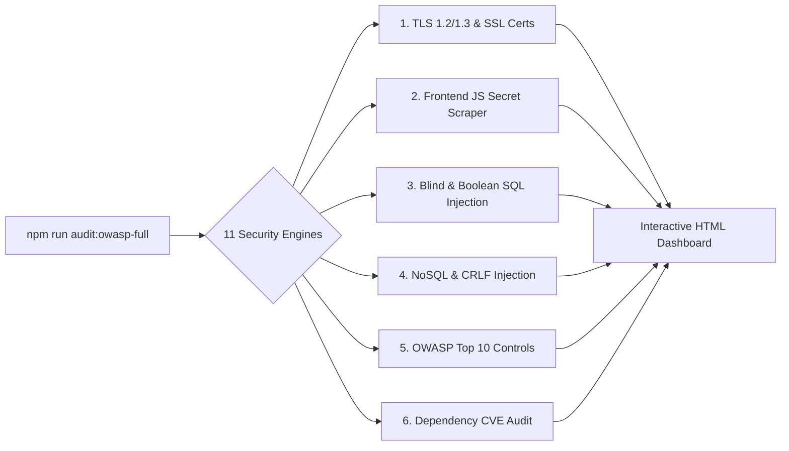
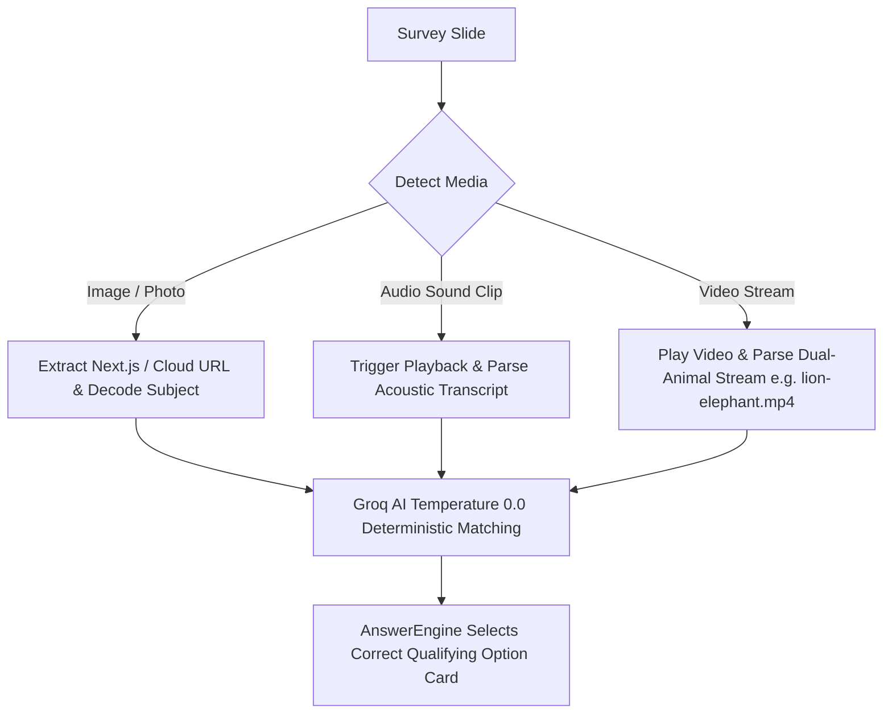

# Hercules & Super J — Test Automation & Security Suite

[](https://playwright.dev/)
[](https://owasp.org/)
[](https://nodejs.org/)
[](https://groq.com/)
[-10B981)](#-enterprise-security-testing-suite)

An enterprise-grade, multimodal test automation and security compliance framework for **Hercules B2B (Creator Platform)** and **Super J (Consumer Respondent App)**.

---

## 📑 Table of Contents

- [🛡️ Enterprise Security Suite (OWASP Top 10 & SQLi)](#️-enterprise-security-suite-owasp-top-10--sqli)
  - [Security Testing Engines](#security-testing-engines)
  - [Security Commands](#security-commands)
  - [Interactive HTML Dashboard](#interactive-html-dashboard)
- [🤖 Autonomous AI E2E Testing Engine](#-autonomous-ai-e2e-testing-engine)
  - [Multimodal Attention-Checker Engine](#multimodal-attention-checker-engine)
  - [Supported Question Handlers](#supported-question-handlers)
- [🧰 Project Architecture](#-project-architecture)
- [🚀 Quick Start & CLI Reference](#-quick-start--cli-reference)

---

## 🛡️ Enterprise Security Suite (OWASP Top 10 & SQLi)

The security suite continuously audits target environments (`https://dev.hercules.works`) against all **OWASP Top 10** categories, TLS transport standards, secret leakage, and injection vulnerabilities in **~4 seconds**.



### Security Testing Engines

1. **💉 Multi-Vector SQL Injection Engine (`A03-SQLI-BLIND`, `A03-SQLI-BOOL`, `A03-SQLI-UNION`)**:
   - **Time-Based Blind SQLi**: Benchmarks response baselines vs. asynchronous database delays (`SLEEP(3)`, `pg_sleep(3)`).
   - **Boolean & Syntax SQLi**: Injects logic bypasses (`1' OR '1'='1`) to verify queries do not leak database syntax or driver exceptions.
   - **UNION-Based SQLi**: Injects `UNION SELECT` statements to test against unauthorized table exfiltration.
   - **OWASP ZAP Active Fuzzing**: Targeted active rules for MySQL, PostgreSQL, SQLite, MSSQL, and Oracle.
2. **🕵️ Frontend JS Secret & Token Scraper (`SEC-01`)**:
   - Scans production Next.js bundles (`/_next/static/chunks/*.js`) for leaked **AWS Keys, Stripe Secret Keys, Private API Tokens, and Webhooks**.
3. **🔐 TLS Certificate & Protocol Engine (`TLS-01`, `TLS-02`)**:
   - Performs live TLS handshakes to verify insecure protocols (SSLv3, TLS 1.0, TLS 1.1) are rejected and validates SSL expiration days.
4. **⚡ NoSQL & CRLF Header Injection (`A03-NOSQL`, `A03-CRLF`)**:
   - Tests parameter handling against NoSQL operator injection (`$ne`, `$gt`) and HTTP response header splitting (`%0d%0aSet-Cookie:`).
5. **🛡️ 360° OWASP Top 10 Controls**:
   - **A01 Broken Access Control**: Validates client-side route guards on `/ai`, `/dashboard`, `/settings` and verifies `/admin` / `/api/user` return `404`.
   - **A02 Cryptographic Failures**: Enforces HSTS (`max-age=63072000; includeSubDomains; preload`) and port 80 encryption.
   - **A05 Security Misconfiguration**: Verifies CSP, Clickjacking (`X-Frame-Options: DENY`), MIME sniffing (`nosniff`), and blocked dotfiles (`.env`, `.git`, `wp-config.php`, `config.json`).
   - **A06 Software Composition Analysis**: Executes automated `npm audit` for dependency CVEs.
   - **A07 Authentication & Cookie Flags**: Enforces `Secure`, `HttpOnly`, and `SameSite` cookie flags.
   - **A09 Error & Exception Masking**: Verifies malformed URI traversal (`%c0%ae`) returns clean error pages without stack trace disclosure.
   - **A10 SSRF & Open Redirects**: Tests callback and AWS internal metadata IP redirection (`169.254.169.254`).
   - **CORS Policy**: Verifies arbitrary origin reflection with credentials is strictly rejected.

### Security Commands

```bash
# Run the complete 10/10 Enterprise Security Audit (~4s)
npm run audit:owasp-full

# Run targeted SQL Injection & SSRF fuzzing via Playwright + OWASP ZAP
npm run test:security:sqli-ssrf

# Run Playwright proxy passive security scan
npm run test:security:passive

# Run full active penetration fuzzing scan
npm run test:security:active

# Run lightweight baseline security headers audit
npm run audit:security
```

### Interactive HTML Dashboard
The security audit generates an interactive visual report at:
`test-results/security/owasp-enterprise-10-10-report.html`

- **Interactive Metric Filters**: Click on **"Passed Controls (29)"** or **"Hardening Recommendations (1)"** to instantly filter tests.
- **Deep Evidence Cards**: Every test displays **What Was Sent**, **Security Rationale**, **Expected vs. Actual Result**, and **Raw HTTP Proof**.

---

## 🤖 Autonomous AI E2E Testing Engine

The E2E automation engine autonomously navigates, answers, and completes complex surveys on **Super J** and **Hercules B2B** using **Groq LLMs (`Llama 3.3 70B`)**.

### Multimodal Attention-Checker Engine

Surveys deploy bot-prevention checks that require multimodal reasoning:



- **Visual Image Recognition**: Decodes subject names from Next.js optimized images (`/_next/image`) and Google Cloud Storage URLs to identify pictures accurately.
- **Audio Sound Matching**: Plays audio triggers, extracts acoustic metadata / Whisper transcripts, and selects the matching picture option.
- **Video Attention Checks**: Plays HTML5 video, parses compound streams (e.g. `lion-elephant.mp4`), and answers visual vs. audio questions with 100% accuracy.

### Supported Question Handlers

| Question Schema | Handler Function | Automated Logic |
| :--- | :--- | :--- |
| **Single-Choice Cards** | `answerSingleChoice` | Evaluates question context via Groq; single-clicks the qualifying option card. |
| **Multi-Select Checkboxes** | `answerMultiSelect` | Selects all relevant qualifying options with single-click card toggling. |
| **Matrix Dropdown Grid** | `answerDropdown` | Iterates across dropdown rows, selects ratings, and saves values. |
| **Ranking Cards** | `answerRanking` | Prompts Groq for ranked preference and clicks cards in order (1st to Nth). |
| **Star / Numeric Ratings** | `answerRating` | Selects qualifying satisfaction ratings (4-5 stars / 8-10 points). |
| **Open-Ended Textareas** | `answerTextbox` | Prompts Groq to write concise, contextual responses (capped to 120 chars). |

---

## 🧰 Project Architecture

```
├── config/
│   └── hercules.config.js       # Environment configuration (dev, preprod, prod)
├── fixtures/
│   └── zapFixture.js            # Playwright fixture with ZAP proxy configuration
├── scripts/
│   ├── fullSecuritySuite.js     # Master 10/10 Enterprise Security & OWASP Audit Engine
│   └── securityAudit.js         # Lightweight baseline headers & cookie audit
├── tests/
│   ├── security/
│   │   ├── ZapSqlInjectionAndSsrf.spec.js  # Targeted SQLi & SSRF active scan spec
│   │   ├── ZapPassiveScan.spec.js          # Passive ZAP proxy scan spec
│   │   └── ZapActiveScan.spec.js           # Full active penetration fuzzing spec
│   └── SurveyTest.spec.js       # AI-driven autonomous survey execution tests
└── utils/
    ├── ZapClient.js             # OWASP ZAP REST API client
    ├── AnswerEngine.js          # Core DOM inspection and Groq AI answering logic
    ├── LiveAIAssistant.js       # Groq API orchestrator (Llama 3.3 / GPT-OSS)
    └── OnboardingUtil.js        # Automated demographic onboarding utilities
```

---

## 🚀 Quick Start & CLI Reference

### 1. Installation

```bash
# Clone the repository
git clone https://github.com/Karthik751170/playwright-js-project.git
cd playwright-js-project

# Install dependencies
npm install

# Install Playwright browser binaries
npx playwright install chromium
```

### 2. Environment Configuration

Create a `.env` file in the root directory:
```env
GROQ_API_KEY=your_groq_api_key
ENV=dev
TARGET_URL=https://dev.hercules.works
```

### 3. Test Execution

```bash
# 🛡️ Run Enterprise Security Audit
npm run audit:owasp-full

# 🤖 Run AI-Driven Survey Automation Tests
npm run test:survey

# 📊 Generate Allure Test Report
npm run allure:generate && npm run allure:open
```
