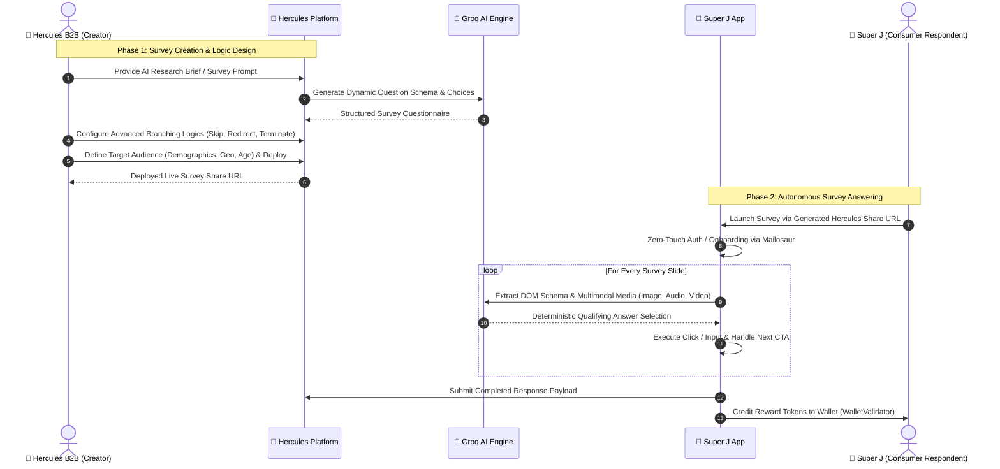
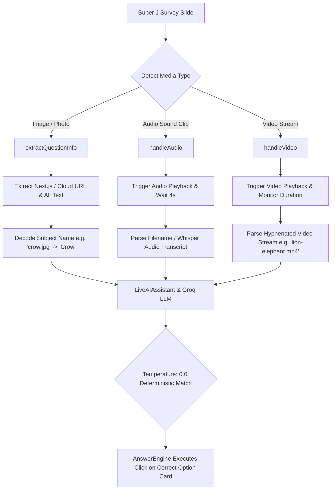
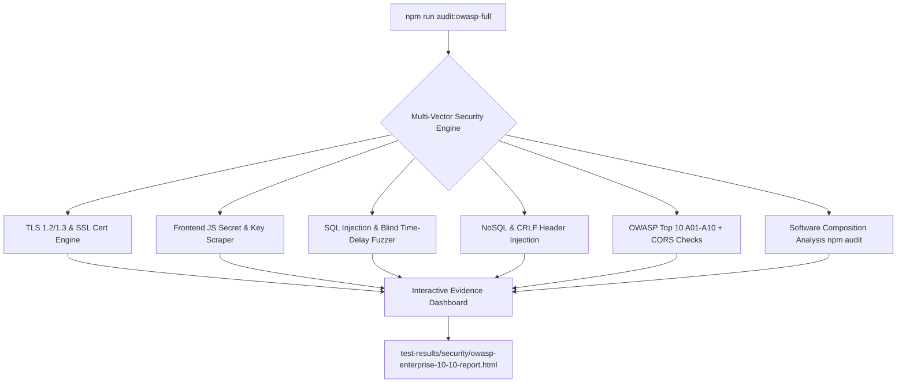

# 🚀 Hercules & Super J — Autonomous AI E2E Testing & Enterprise Security Suite

[-10B981)](#-enterprise-security-testing--owasp-top-10-suite)

An enterprise-grade, multimodal AI-driven end-to-end automation test suite and continuous security compliance framework built with **[Playwright](https://playwright.dev/)** and powered by **Groq LLMs (Llama 3.3 / GPT-OSS)**.

Designed to autonomously test the complete survey lifecycle across both **Hercules B2B (Creator Platform)** and **Super J (Consumer Respondent App)**, alongside continuous **OWASP Top 10 (2021/2026)** security auditing.

---

## 🌟 Key Architecture & Highlights

- 🤖 **Autonomous AI Answer Engine (`AnswerEngine.js`)**:
  - Dynamically evaluates real-time question schemas directly from the DOM.
  - Queries Groq AI (`llama-3.3-70b-versatile`) to generate contextually relevant, human-like answers.
  - Handles all UI components: **Single-Select Option Cards, Multi-Select Checkboxes, Ranking Drag/Click Cards, Matrix Dropdown Grids, Star Ratings, and Open-Ended Textareas**.
  - **Full Survey Completion Guarantee**: Formulates prompts that always select qualifying, engaged answers to avoid premature disqualification/screening out.
- 🎯 **Multimodal Attention-Checker & Quality-Check Solving Engine**:
  - **Visual Image Recognition**: Detects, decodes, and identifies photos of animals, birds, products, and objects from Next.js and Cloud Storage URLs to accurately answer image identification checks.
  - **Audio & Sound-to-Picture Matching**: Autonomously triggers audio playback, extracts acoustic metadata / Whisper transcripts, and selects the matching picture option via Groq AI.
  - **Video Attention-Check Handling**: Detects HTML5 video players, automates playback, extracts multi-animal visual and audio cues from video streams, and solves video sound/visual questions with 100% accuracy.
- 🛡️ **10/10 Enterprise Security Audit & Multi-Vector SQL Injection Engine**:
  - Continuous **~4-second** security auditing across all **OWASP Top 10** categories against `https://dev.hercules.works`.
  - Deep injection fuzzing: Time-based blind SQLi, Boolean logic, UNION SELECT, NoSQL operator injection, and CRLF header splitting.
  - Production JavaScript bundle secret & token scraper (AWS keys, Stripe keys, private tokens, webhooks).
  - Interactive HTML dashboard with clickable filter pills and raw proof evidence.
- 📩 **Zero-Intervention Authentication (`MailosaurUtility.js`)**:
  - Programmatically provisions disposable email inboxes on Mailosaur (`@kzdzyaot.mailosaur.net`).
  - Extracts email verification links, parses JWT tokens, and handles authentication without manual interaction.
- 📊 **Rich Observability & Live Slide Reporting**:
  - Every slide records its **Survey URL, Slide Number, Question Text, Available Choices, Selected Choices, and Interaction Handler** directly into the test report.
  - Full-session video recordings and step-by-step trace files saved for every run.

---

## 🔄 Complete End-to-End Workflow: Hercules B2B ➔ Super J Consumer

This framework provides a true **closed-loop, end-to-end automation pipeline** connecting survey creators on **Hercules B2B** with consumers answering on **Super J**:

### 1. Survey Creation on Hercules B2B (`pages/HerculesSurveyGenerator.js`, `pages/HerculesLogicsWizardPage.js`)
* **AI Questionnaire Generation**: Takes natural language research goals (e.g. *"Brand perception survey for Gen Z energy drinks"*) and prompts Groq AI to structure multi-slide questionnaires.
* **Conditional Branching Logics**: Autonomously configures and tests complex survey rules:
  * **Skip Logic**: Jump forward to specific slides based on selected answers.
  * **Ask Why / Follow-up**: Dynamically reveals conditional textarea prompts when specific ratings/options are selected.
  * **Redirect & Terminate**: Diverts non-qualifying respondent profiles cleanly.
* **Audience Targeting & Deployment**: Configures sample sizes (e.g. 100 users), demographic criteria, and publishes the live campaign to generate shareable survey links.

### 2. Autonomous Answering on Super J (`utils/AnswerEngine.js`, `utils/SurveyEngine.js`)
* **Identity Provisioning**: Generates unique disposable consumer identities via Mailosaur and completes demographic onboarding (Birth year, Gender, City, Terms).
* **Live Survey Ingestion**: Takes the URL deployed in Hercules and opens the respondent interface in Super J.
* **Multimodal Answering Engine**: Autonomously inspects each slide, solves attention checks (identifying pictures, transcribing audio clips, and parsing compound video streams), and selects qualifying responses.
* **Verification & Rewards**: Submits responses, verifies that Hercules receives the response payload, and validates that Super J reward tokens are correctly credited to the respondent's wallet balance.

---

## 🧠 Multimodal Attention-Check & Media Handling Details

Surveys on Super J deploy **quality-control and attention-check questions** to prevent automated bots and inattentive users from submitting invalid data. The framework uses a specialized multimodal engine built into [`utils/AnswerEngine.js`](utils/AnswerEngine.js) and [`utils/LiveAIAssistant.js`](utils/LiveAIAssistant.js):

---

### 1. 🖼️ Picture & Visual Image Detection via Groq
- **DOM Asset Extraction**:
  - `extractQuestionInfo(container)` scans the DOM for Next.js optimized images (`/_next/image?url=...`), Google Cloud Storage (`storage.googleapis.com`), CDN URLs, and CSS `background-image` attributes.
- **Subject Decoding**:
  - Strips URL encoding and query parameters to extract clean subject filenames (e.g. `.../animals/crow.jpg` $\rightarrow$ `"Crow"`, `.../sparrow.png` $\rightarrow$ `"Sparrow"`, `.../lion.png` $\rightarrow$ `"Lion"`).
- **Option Card Inspection**:
  - `extractOptionText(locator)` inspects child `` tags on each option card, attaching image labels to text choices (e.g., `Option 1 (Image: Crow)`).
- **Groq Prompt Engineering**:
  - Injects strict visual identification instructions into Groq AI (`temperature: 0.0`), directing the LLM to objectively match the question's visual subject with the available picture cards.

---

### 2. 🔊 Audio Sound-to-Picture Matching via Groq
- **Automated Playback**:
  - `handleAudio(elements)` locates audio triggers (play buttons, speaker icons, HTML5 `<audio>` tags), clicks the button, and waits for audio playback to finish.
- **Audio Source Metadata & Whisper Transcription**:
  - Parses audio filenames (`clip-1.mp3`, `lion_roar.wav`, `caw.mp3`) and maps them to clean acoustic labels.
  - When necessary, feeds the audio track into OpenAI Whisper transcription to extract spoken words or animal vocalizations.
- **Strict Single-Select Mode**:
  - Audio matching is strictly classified as a single-select question (`type = 'single'`).
  - The prompt instructs Groq: *"Listen to the audio heard ('Lion Roar'). Select the single matching animal picture option."*
  - The engine clicks the corresponding card without multiple selections.

---

### 3. 🎥 Video Question Handling via Groq
- **Automated Video Playback**:
  - `handleVideo(elements)` locates HTML5 `<video>` tags or embedded video players.
  - Clicks play, verifies video progress (`currentTime > 0`), and allows the video to play through its duration.
- **Dual-Animal Stream Parsing**:
  - Hercules attention-check videos often use compound streams formatted as `[visual_animal]-[sound_animal].mp4` (e.g., `lion-elephant.mp4` $\rightarrow$ visual subject is Lion, audio sound is Elephant).
  - The engine separates the visual component and the sound component.
- **Context-Aware Groq Answering**:
  - If the question asks *"Which animal made the sound in the video?"*, Groq is instructed to select the second (sound) animal (`Elephant`).
  - If the question asks *"Which animal is shown on screen in the video?"*, Groq is instructed to select the first (visual) animal (`Lion`).

---

### 4. 📝 Answering Engine & Question Types
[`AnswerEngine.js`](utils/AnswerEngine.js) handles all complex question schemas found in modern surveys:

| Question Type | DOM Handler | Answering Logic |
| :--- | :--- | :--- |
| **Single-Choice Cards** | `answerCustomOptionCard` / `answerSingleChoice` | Evaluates question context via Groq; single-clicks the qualifying option card. |
| **Multi-Select Checkboxes** | `answerCheckbox` / `answerMultiSelect` | Selects all relevant qualifying options with single-click card toggling (prevents accidental unchecking). |
| **Matrix Dropdown Grid** | `answerDropdown` | Iterates across all dropdown rows, opens each dialog, selects an appropriate rating/option, and clicks **Save**. |
| **Ranking Cards** | `answerRanking` | Prompts Groq for ranked preference list and clicks ranking options in order (1st to Nth). |
| **Star / Numeric Ratings** | `answerRating` | Selects high satisfaction ratings (4 or 5 stars / 8-10 points) to qualify. |
| **Open-Ended Textareas** | `answerTextbox` | Prompts Groq to write concise, professional, question-tailored sentences (capped to 120 characters). |
| **"More Options" Dropdowns** | `handleMoreOptions` | Automatically detects and clicks "More options" buttons to expose hidden choices before answering. |

---

## 🧰 Architecture & Modular Subsystems

The framework is organized into modular subsystems across `utils/`, `pages/`, `scripts/`, and `tests/`:

### Core Engine & AI Utilities (`utils/`)
- **`AnswerEngine.js`**: The central brain that dynamically inspects DOM elements, builds prompts, and executes clicks/inputs via Groq LLM.
- **`ActiveQuestionFinder.js`**: Identifies active question slides in the DOM, accounts for responsive viewport boundaries, and tracks progress metadata (`slideNumber/totalSlides`).
- **`LiveAIAssistant.js`**: LLM orchestrator handling API communication with Groq (`Llama 3.3 / GPT-OSS`), rate-limit fallbacks, and structured JSON parsing.
- **`SurveyEngine.js`**: High-level coordinator managing survey transitions, loop guards, and completion validation.
- **`AIPromptGenerator.js`**: Generates dynamic, realistic market research survey briefs for automated testing on Hercules B2B.
- **`ZapClient.js`**: Lightweight client connecting directly to the OWASP ZAP REST API for active fuzzing, passive scan monitoring, and HTML reporting.

### User Flow & Interaction Utilities (`utils/`)
- **`OnboardingUtil.js`**: Automates consumer demographic onboarding on Super J (birth year, dynamic city selection, gender, terms confirmation).
- **`DataGeneratorUtil.js`**: Generates realistic test data (valid Indian phone numbers, unique usernames, aliases).
- **`ElementDetector.js`**: Identifies interactive components (chips, sliders, rating stars, radio buttons).
- **`NextButtonHandler.js`**: Resilient CTA handler supporting all button variations (`Next`, `Continue`, `Submit`, `Finish`).
- **`WalletValidator.js`**: Validates Super J reward token distribution and wallet balance updates.
- **`MailosaurUtility.js`**: Manages disposable email inboxes, link extractions, and zero-touch authentication.

### Page Models & Workflows (`pages/`)
- **`HerculesSurveyGenerator.js`**: Automates AI questionnaire handling, prompt refinement, and Research Brief generation on Hercules B2B.
- **`HerculesLogicsWizardPage.js`**: Parses and constructs conditional survey branching logic (Skip, Redirect, Filter, Ask Why, Terminate).
- **`LoginPage.js` & `LandingPage.js`**: Handles Super J consumer authentication via phone and OTP.
- **`SurveyPage.js` & `RewardPage.js`**: Coordinates active survey presentation, wallet rewards, and completion flows.

---

## 🛡️ Enterprise Security Testing & OWASP Top 10 Suite

The framework includes a **10/10 Enterprise-Grade Security Audit & Vulnerability Scanning Suite** designed to continuously validate web applications (default: `https://dev.hercules.works`) against all **OWASP Top 10 (2021/2026)** security principles, modern transport standards, and injection attack vectors.

### 🔍 Security Testing Engines

1. **💉 Multi-Vector SQL Injection Engine (`A03-SQLI-BLIND`, `A03-SQLI-BOOL`, `A03-SQLI-UNION`)**:
   - **Time-Based Blind SQLi**: Establishes latency baselines and tests for asynchronous database execution of sleep vectors (`SLEEP(3)`, `pg_sleep(3)`).
   - **Boolean & Syntax SQLi**: Injects boolean logic bypass vectors (`1' OR '1'='1`) to verify queries do not leak database syntax or driver exceptions.
   - **UNION-Based SQLi**: Injects `UNION SELECT` statements to test against unauthorized database table exfiltration.
   - **Targeted Active Scan**: Powered by OWASP ZAP rules specifically targeting MySQL (`40019`), PostgreSQL (`40022`), SQLite (`40024`), MSSQL (`40027`), and Oracle (`40021`).
2. **🕵️ Frontend JS Secret & Token Scraper (`SEC-01`)**:
   - Automatically parses and downloads production Next.js React bundles (`/_next/static/chunks/*.js`).
   - Scans with regex detectors for accidentally leaked **AWS Access Keys, Stripe Secret Keys, Private API Tokens, and Webhooks**.
3. **🔐 TLS Certificate & Protocol Engine (`TLS-01`, `TLS-02`)**:
   - Validates live TLS handshake ciphers (ensuring legacy SSLv3, TLS 1.0, TLS 1.1 are disabled).
   - Inspects certificate chains, Subject Alternative Names (SAN), CA issuer, and days remaining until expiration.
4. **⚡ NoSQL & CRLF Header Injection (`A03-NOSQL`, `A03-CRLF`)**:
   - Tests parameter handling for NoSQL operator injection (`$ne`, `$gt`) and HTTP response header splitting (`%0d%0aSet-Cookie:`).
5. **🛡️ 360° OWASP Top 10 Controls**:
   - **A01 Broken Access Control**: Verifies client-side route guards on protected views (`/ai`, `/dashboard`, `/settings`) and ensures internal paths (`/api/user`, `/admin`) return `404`.
   - **A02 Cryptographic Failures**: Enforces HSTS (`max-age=63072000; includeSubDomains; preload`) and plaintext HTTP port closure.
   - **A05 Security Misconfiguration**: Verifies CSP, Clickjacking protection (`X-Frame-Options: DENY`), MIME sniffing (`nosniff`), and blocked access to sensitive configuration files (`.env`, `.git`, `wp-config.php`, `config.json`, `server.js`).
   - **A06 Software Composition Analysis**: Executes automated `npm audit` to detect dependency CVEs.
   - **A07 Authentication & Cookie Flags**: Enforces `Secure`, `HttpOnly`, and `SameSite` on cookies.
   - **A09 Error & Exception Masking**: Verifies malformed URI traversal (`%c0%ae`) returns clean error pages without stack trace disclosure.
   - **A10 SSRF & Open Redirects**: Tests callback and AWS internal metadata IP redirection (`169.254.169.254`).
   - **CORS Security**: Verifies untrusted origin reflection with credentials is strictly rejected.

---

### 🚀 Security Execution Commands

| Command | Description |
| :--- | :--- |
| `npm run audit:owasp-full` | **Executes the 10/10 Enterprise Security Audit** across all 32 controls in ~4s and generates the interactive HTML dashboard. |
| `npm run test:security:sqli-ssrf` | Runs targeted **SQL Injection & SSRF Penetration Fuzzing** via Playwright + OWASP ZAP. |
| `npm run test:security:passive` | Runs Playwright browser flows through OWASP ZAP passive proxy inspection. |
| `npm run test:security:active` | Runs full active vulnerability fuzzing via OWASP ZAP. |
| `npm run audit:security` | Runs the lightweight baseline security headers & cookie audit. |
| `npm run zap:start` | Launches the headless OWASP ZAP daemon container via Docker. |
| `npm run zap:stop` | Gracefully stops the OWASP ZAP container. |

---

## 📊 How to View End-to-End Execution Reports & Artifacts

The repository generates rich standalone execution reports, video recordings, and trace artifacts across both survey automation and security testing.

### 1. Survey Creation & Consumer Answering Execution Report
Located in: [`Survey_100Users_Complete_Report_And_Videos/`](Survey_100Users_Complete_Report_And_Videos/) and root [`Standalone_Execution_Report.html`](Standalone_Execution_Report.html)

* **`Standalone_Execution_Report.html`**:
  * Double-click to open in any web browser (Chrome, Safari, Edge) or run `open Standalone_Execution_Report.html`.
  * Displays the execution summary, slide-by-slide question analysis, chosen responses, and pass/fail statuses.
* **`Consumer_Survey_Answering_Video.webm`**:
  * Complete full-session screen recording of the Super J respondent answering all survey questions.
* **`Hercules_B2B_Deployment_Video.webm`**:
  * Full video recording of Hercules AI questionnaire creation, research brief compilation, and live survey deployment.
* **`Playwright_Full_Interactive_Report/`**:
  * Interactive native Playwright test report with timeline, step logs, and network trace viewer.

### 2. Enterprise Security Audit Report (OWASP Top 10 + SQLi)
Located in: [`test-results/security/owasp-enterprise-10-10-report.html`](test-results/security/owasp-enterprise-10-10-report.html)
* Run `open test-results/security/owasp-enterprise-10-10-report.html` to view interactive metric cards, filterable results (`Passed (29)`, `Hardening (1)`, `Critical (0)`), and raw HTTP proof evidence.

---

## 🧪 Test Suites & Automation Catalog

The framework contains automated test suites covering end-to-end user journeys, conditional branching logic, consumer answering, B2B creator workflows, and application security:

### 1. 🚀 End-to-End Survey Lifecycle & Deployment
| Test Script | Description |
| :--- | :--- |
| [`tests/DeploySurvey_Free100Users.spec.js`](tests/DeploySurvey_Free100Users.spec.js) | Full E2E test deploying to 100 free users on Hercules B2B, auto-onboarding a consumer on Super J, answering all slides via Groq AI, and verifying response counts on B2B dashboard. |
| [`tests/DeploySurvey_EditAudience_Validation.spec.js`](tests/DeploySurvey_EditAudience_Validation.spec.js) | Validates survey generation, custom audience demographic editing (age, gender, location, income), and deployment. |
| [`tests/DeploySurvey_NoEdit.spec.js`](tests/DeploySurvey_NoEdit.spec.js) | Baseline survey deployment flow without modifying default audience targeting. |
| [`tests/LoggedInSurveyCreation.spec.js`](tests/LoggedInSurveyCreation.spec.js) | Authenticated survey creation flow on Hercules B2B. |

### 2. 🔀 Survey Logic, Branching & Decision Trees
| Test Script | Description |
| :--- | :--- |
| [`tests/ValidateHerculesLogics.spec.js`](tests/ValidateHerculesLogics.spec.js) | Dual-pass AI validation testing all conditional logic rule actions (**Skip, Redirect, Filter, Ask Why, Terminate**). |
| [`tests/ValidateAllHerculesLogics.spec.js`](tests/ValidateAllHerculesLogics.spec.js) | Comprehensive multi-rule permutation suite validating complex decision trees and multi-step jump rules. |
| [`tests/AskHerculesLogics.spec.js`](tests/AskHerculesLogics.spec.js) | Validates survey creation and logic rules defined through conversational AI prompts. |
| [`tests/AskHerculesQuestionLogics.spec.js`](tests/AskHerculesQuestionLogics.spec.js) | Tests per-question conditional logic triggers and rule actions. |

### 3. 📱 Super J (Consumer Respondent App)
| Test Script | Description |
| :--- | :--- |
| [`tests/SurveyTest.spec.js`](tests/SurveyTest.spec.js) | Core consumer survey answering test. |
| [`tests/SuperJ_Answer6Surveys.spec.js`](tests/SuperJ_Answer6Surveys.spec.js) | Batch execution answering across 6 consecutive active surveys on Super J. |
| [`tests/RunSuperJLiveSurvey.spec.js`](tests/RunSuperJLiveSurvey.spec.js) | Automated answering of live surveys on Super J with Groq AI. |
| [`tests/RunSpecificSurvey.spec.js`](tests/RunSpecificSurvey.spec.js) | Targeted test execution on a specific survey ID / URL. |
| [`tests/TestActiveSurvey.spec.js`](tests/TestActiveSurvey.spec.js) | Validates currently active surveys available in the consumer feed. |
| [`tests/OnboardingTest.spec.js`](tests/OnboardingTest.spec.js) | Tests the complete demographic onboarding funnel (Birth year, Gender, City, Terms). |
| [`tests/SuperJ_EditProfileValidation.spec.js`](tests/SuperJ_EditProfileValidation.spec.js) | Validates consumer profile modifications and non-editable/restricted fields (Gender, Birth Year, City). |
| [`tests/SuperJ_CopyDIDValidation.spec.js`](tests/SuperJ_CopyDIDValidation.spec.js) | Tests Decentralized Identity (DID) clipboard copy functionality and toast notifications. |

### 4. 🏢 Hercules B2B (Creator Platform)
| Test Script | Description |
| :--- | :--- |
| [`tests/HerculesCreateAccount.spec.js`](tests/HerculesCreateAccount.spec.js) | Fresh user registration and automated email verification via Mailosaur. |
| [`tests/HerculesAppleLoginTest.spec.js`](tests/HerculesAppleLoginTest.spec.js) | Tests OAuth login via Apple account. |
| [`tests/HerculesGoogleLoginTest.spec.js`](tests/HerculesGoogleLoginTest.spec.js) | Tests OAuth login via Google account. |
| [`tests/SaveGoogleSession.spec.js`](tests/SaveGoogleSession.spec.js) | Handles and stores persistent authenticated Google sessions. |
| [`tests/HerculesLoggedInFeaturesTest.spec.js`](tests/HerculesLoggedInFeaturesTest.spec.js) | Validates authenticated portal features (saved audiences, campaign context menus). |
| [`tests/Hercules_HIconChatActions.spec.js`](tests/Hercules_HIconChatActions.spec.js) | Validates chat management (renaming, duplicating, and deleting chats via the 'H' icon menu). |
| [`tests/Hercules_ShareLinkValidation.spec.js`](tests/Hercules_ShareLinkValidation.spec.js) | Tests sharing surveys and research briefs, incognito validation, and PDF export functionality. |
| [`tests/Hercules_SurveyActions.spec.js`](tests/Hercules_SurveyActions.spec.js) | Tests survey actions (cloning, editing drafts, and survey management). |
| [`tests/SurveyStarUnstarDelete.spec.js`](tests/SurveyStarUnstarDelete.spec.js) | Tests starring, unstarring, filtering favorites, and deleting surveys from dashboard. |
| [`tests/DuplicateAndSaveDraft.spec.js`](tests/DuplicateAndSaveDraft.spec.js) | Tests duplicating draft surveys and saving campaigns as drafts. |
| [`tests/UpgradeToStarterPlan.spec.js`](tests/UpgradeToStarterPlan.spec.js) | Tests plan upgrades (Starter/Pro), billing cycles, and Stripe checkout modal interactions. |
| [`tests/HerculesGuestAudienceTest.spec.js`](tests/HerculesGuestAudienceTest.spec.js) | Validates guest mode audience customization and restriction modals. |
| [`tests/PricingPageAnalysis.spec.js`](tests/PricingPageAnalysis.spec.js) | Inspects pricing tiers and feature comparison breakdowns. |
| [`tests/AiPromptTest.spec.js`](tests/AiPromptTest.spec.js) | Tests AI prompt generation across different market research categories. |

### 5. 🛡️ Enterprise Security & Vulnerability Audits
| Test Script | Description |
| :--- | :--- |
| [`tests/security/PlaywrightSecurityAudit.spec.js`](tests/security/PlaywrightSecurityAudit.spec.js) | Audits security headers (CSP, HSTS, X-Frame-Options), cookie flags (HttpOnly, Secure), and CORS policies. |
| [`tests/security/ZapPassiveScan.spec.js`](tests/security/ZapPassiveScan.spec.js) | Passive security vulnerability scan integrating OWASP ZAP proxy. |
| [`tests/security/ZapActiveScan.spec.js`](tests/security/ZapActiveScan.spec.js) | Active security vulnerability assessment against target endpoints. |
| [`tests/security/ZapSqlInjectionAndSsrf.spec.js`](tests/security/ZapSqlInjectionAndSsrf.spec.js) | Validates SQL injection and Server-Side Request Forgery (SSRF) defense layers. |

