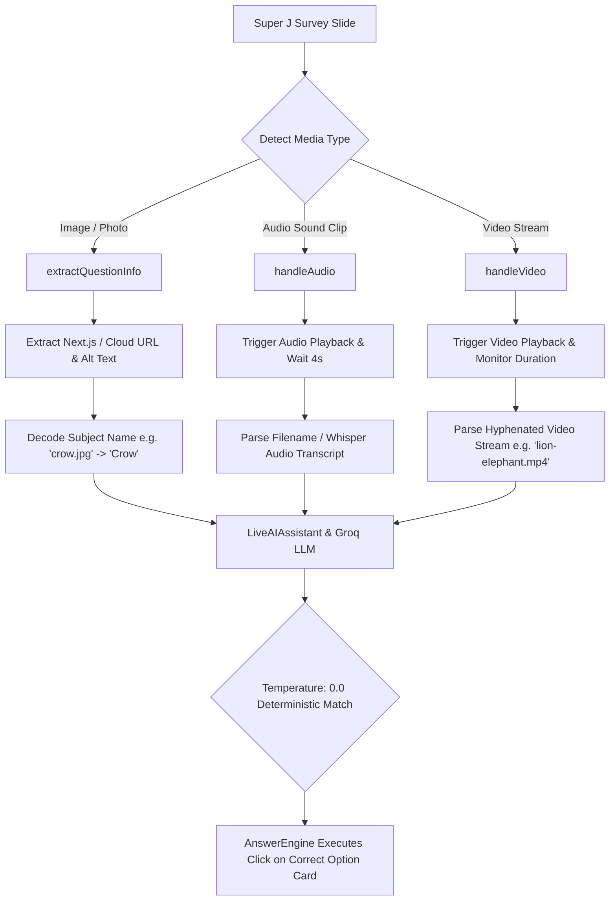

# 🚀 Hercules & Super J — Autonomous AI E2E Testing Framework

An enterprise-grade, multimodal AI-driven end-to-end automation test suite built with **[Playwright](https://playwright.dev/)** and powered by **Groq LLMs (Llama 3.3 / GPT-OSS)**.

Designed to autonomously test the complete survey lifecycle across both **Hercules B2B (Creator Platform)** and **Super J (Consumer Respondent App)**.

---

## 🌟 Key Architecture & Highlights

- 🤖 **Autonomous AI Answer Engine (`AnswerEngine.js`)**:
  - Dynamically evaluates real-time question schemas directly from the DOM.
  - Queries Groq AI (`llama-3.3-70b-versatile`) to generate contextually relevant, human-like answers.
  - Handles all UI components: **Single-Select Option Cards, Multi-Select Checkboxes, Ranking Drag/Click Cards, Matrix Dropdown Grids, Star Ratings, and Open-Ended Textareas**.
  - **Full Survey Completion Guarantee**: Formulates prompts that always select qualifying, engaged answers to avoid premature disqualification/screening out.
- 🎯 **Multimodal Attention-Checker & Quality-Check Solving Engine**:
  - **Visual Image Recognition**: Detects, decodes, and identifies photos of animals, birds, products, and objects from Next.js and Cloud Storage URLs to accurately answer image identification checks.
  - **Audio & Sound-to-Picture Matching**: Autonomously triggers audio playback, extracts acoustic metadata / Whisper transcripts, and selects the matching picture option via Groq AI.
  - **Video Attention-Check Handling**: Detects HTML5 video players, automates playback, extracts multi-animal visual and audio cues from video streams, and solves video sound/visual questions with 100% accuracy.
- ⚡ **Seamless 100-User Free Deployment Flow**:
  - Directly targets survey card deployment triggers to launch surveys to 100 users for free.
  - Automatically bridges the B2B draft survey to the live Super J consumer environment.
- 📩 **Zero-Intervention Authentication (`MailosaurUtility.js`)**:
  - Programmatically provisions disposable email inboxes on Mailosaur (`@kzdzyaot.mailosaur.net`).
  - Extracts email verification links, parses JWT tokens, and handles authentication without manual interaction.
- 📊 **Rich Observability & Live Slide Reporting**:
  - Every slide records its **Survey URL, Slide Number, Question Text, Available Choices, Selected Choices, and Interaction Handler** directly into the test report.
  - Full-session video recordings and step-by-step trace files saved for every run.

---

## 🧠 Multimodal Attention-Check & Media Handling Details

Surveys on Super J deploy **quality-control and attention-check questions** to prevent automated bots and inattentive users from submitting invalid data. The framework uses a specialized multimodal engine built into [`utils/AnswerEngine.js`](utils/AnswerEngine.js) and [`utils/LiveAIAssistant.js`](utils/LiveAIAssistant.js):



---

### 1. 🖼️ Picture & Visual Image Detection via Groq
- **DOM Asset Extraction**:
  - `extractQuestionInfo(container)` scans the DOM for Next.js optimized images (`/_next/image?url=...`), Google Cloud Storage (`storage.googleapis.com`), CDN URLs, and CSS `background-image` attributes.
- **Subject Decoding**:
  - Strips URL encoding and query parameters to extract clean subject filenames (e.g. `.../animals/crow.jpg` $\rightarrow$ `"Crow"`, `.../sparrow.png` $\rightarrow$ `"Sparrow"`, `.../lion.png` $\rightarrow$ `"Lion"`).
- **Option Card Inspection**:
  - `extractOptionText(locator)` inspects child `` tags on each option card, attaching image labels to text choices (e.g., `Option 1 (Image: Crow)`).
- **Groq Prompt Engineering**:
  - Injects strict visual identification instructions into Groq AI (`temperature: 0.0`), directing the LLM to objectively match the question's visual subject with the available picture cards.

---

### 2. 🔊 Audio Sound-to-Picture Matching via Groq
- **Automated Playback**:
  - `handleAudio(elements)` locates audio triggers (play buttons, speaker icons, HTML5 `<audio>` tags), clicks the button, and waits for audio playback to finish.
- **Audio Source Metadata & Whisper Transcription**:
  - Parses audio filenames (`clip-1.mp3`, `lion_roar.wav`, `caw.mp3`) and maps them to clean acoustic labels.
  - When necessary, feeds the audio track into OpenAI Whisper transcription to extract spoken words or animal vocalizations.
- **Strict Single-Select Mode**:
  - Audio matching is strictly classified as a single-select question (`type = 'single'`).
  - The prompt instructs Groq: *"Listen to the audio heard ('Lion Roar'). Select the single matching animal picture option."*
  - The engine clicks the corresponding card without multiple selections.

---

### 3. 🎥 Video Question Handling via Groq
- **Automated Video Playback**:
  - `handleVideo(elements)` locates HTML5 `<video>` tags or embedded video players.
  - Clicks play, verifies video progress (`currentTime > 0`), and allows the video to play through its duration.
- **Dual-Animal Stream Parsing**:
  - Hercules attention-check videos often use compound streams formatted as `[visual_animal]-[sound_animal].mp4` (e.g., `lion-elephant.mp4` $\rightarrow$ visual subject is Lion, audio sound is Elephant).
  - The engine separates the visual component and the sound component.
- **Context-Aware Groq Answering**:
  - If the question asks *"Which animal made the sound in the video?"*, Groq is instructed to select the second (sound) animal (`Elephant`).
  - If the question asks *"Which animal is shown on screen in the video?"*, Groq is instructed to select the first (visual) animal (`Lion`).

---

### 4. 📝 Answering Engine & Question Types
[`AnswerEngine.js`](utils/AnswerEngine.js) handles all complex question schemas found in modern surveys:

| Question Type | DOM Handler | Answering Logic |
| :--- | :--- | :--- |
| **Single-Choice Cards** | `answerCustomOptionCard` / `answerSingleChoice` | Evaluates question context via Groq; single-clicks the qualifying option card. |
| **Multi-Select Checkboxes** | `answerCheckbox` / `answerMultiSelect` | Selects all relevant qualifying options with single-click card toggling (prevents accidental unchecking). |
| **Matrix Dropdown Grid** | `answerDropdown` | Iterates across all dropdown rows, opens each dialog, selects an appropriate rating/option, and clicks **Save**. |
| **Ranking Cards** | `answerRanking` | Prompts Groq for ranked preference list and clicks ranking options in order (1st to Nth). |
| **Star / Numeric Ratings** | `answerRating` | Selects high satisfaction ratings (4 or 5 stars / 8-10 points) to qualify. |
| **Open-Ended Textareas** | `answerTextbox` | Prompts Groq to write concise, professional, question-tailored sentences (capped to 120 characters). |
| **"More Options" Dropdowns** | `handleMoreOptions` | Automatically detects and clicks "More options" buttons to expose hidden choices before answering. |

---

## 📁 Repository Structure

```
.
├── .github/
│   └── workflows/
│       └── playwright.yml              # GitHub Actions CI/CD Pipeline
├── base/
│   └── BasePage.js                     # Base Playwright page wrapper with retry helpers
├── pages/
│   ├── LandingPage.js                  # Super J Consumer landing page
│   ├── LoginPage.js                    # Super J OTP login page
│   ├── SurveyPage.js                   # Super J active survey presentation
│   ├── RewardPage.js                   # Super J wallet & reward claim
│   ├── hercules/
│   │   ├── HerculesHomePage.js         # Hercules B2B landing & sign-in
│   │   ├── HerculesLoginPage.js        # Hercules B2B auth & token handler
│   │   ├── HerculesSignupPage.js       # Hercules registration flow
│   │   ├── HerculesSurveyGenerator.js  # AI questionnaire & prompt generation
│   │   ├── HerculesLogicsWizardPage.js # 4-step logic wizard builder & parser
│   │   ├── HerculesEditAudience.js     # Audience & demographic controls
│   │   ├── HerculesPaymentModal.js     # Stripe / plan deployment modals
│   │   └── HerculesCampaignManager.js  # Campaign & audience management
│   └── utils/
│       └── MailosaurUtility.js         # Disposable email & OTP/Magic-link handler
├── tests/
│   ├── DeploySurvey_Free100Users.spec.js # Full E2E Free 100 Deployment & Submission
│   ├── ValidateHerculesLogics.spec.js    # Logic Rules Branching & Answering Validation
│   ├── ValidateAllHerculesLogics.spec.js # Multi-rule permutation test suite
│   ├── DeploySurvey_EditAudience_Validation.spec.js # Custom audience targeting test
│   ├── DeploySurvey_NoEdit.spec.js       # Baseline deployment without audience edits
│   ├── SurveyTest.spec.js                # Core Consumer Survey answering test
│   ├── SuperJ_Answer6Surveys.spec.js     # Batch answering across 6 active surveys
│   ├── SuperJ_EditProfileValidation.spec.js # Consumer profile field verification
│   ├── SuperJ_CopyDIDValidation.spec.js  # Decentralized Identity (DID) clipboard test
│   ├── HerculesCreateAccount.spec.js     # Fresh B2B account registration test
│   ├── HerculesLoggedInFeaturesTest.spec.js # Saved audiences & campaign context menus
│   ├── SurveyStarUnstarDelete.spec.js    # Dashboard survey lifecycle management
│   ├── DuplicateAndSaveDraft.spec.js     # Draft survey duplication test
│   ├── UpgradeToStarterPlan.spec.js      # Plan upgrade & Stripe modal test
│   ├── CrawlHerculesB2B.spec.js          # Autonomous B2B portal route crawler
│   └── utils/
│       ├── MailosaurSetup.js           # Automated Mailosaur user provisioning
│       └── SurveyPrompts.js            # Curated industry survey prompts
└── utils/
    ├── AnswerEngine.js                 # LLM-powered dynamic question solver
    ├── ActiveQuestionFinder.js         # Resilient active slide locator & counter
    ├── LiveAIAssistant.js              # Groq & Gemini LLM API orchestrator
    ├── AIPromptGenerator.js            # Dynamic survey prompt provider
    ├── OnboardingUtil.js               # Super J consumer onboarding automation
    ├── DataGeneratorUtil.js            # Dynamic test data generator (phones, IDs)
    ├── ElementDetector.js              # Question UI component & input detector
    ├── NextButtonHandler.js            # Resilient CTA & navigation handler
    ├── PermissionUtil.js               # Browser permissions & clipboard controller
    ├── SurveyEngine.js                 # Survey lifecycle runner & coordinator
    ├── UploadUtil.js                   # Media & file upload helper
    └── WalletValidator.js              # Super J wallet balance & reward validator
```

---

## ⚙️ Environment Setup

Create a `.env` file in the project root:

```env
# Primary LLM API Key (Required for AI answering & survey generation)
GROQ_API_KEY=your_groq_api_key_here
GROQ_API_KEY_2=your_fallback_groq_key   # Optional fallback key

# Mailosaur Credentials (Required for zero-intervention auth)
MAILOSAUR_API_KEY=your_mailosaur_api_key
MAILOSAUR_SERVER_ID=kzdzyaot

# Optional / Fallback notifications
GEMINI_API_KEY=your_gemini_api_key_here
GMAIL_USER=your_email@domain.com
GMAIL_PASS=your_app_password
```

---

## 🛠️ Installation & Quickstart

```bash
# 1. Clone the repository
git clone https://github.com/Karthik751170/playwright-js-project.git
cd playwright-js-project

# 2. Install dependencies
npm install

# 3. Install Playwright browser binaries & system dependencies
npx playwright install --with-deps chromium
```

---

## 📊 Test Reporting & Observability

The framework provides comprehensive, multi-layered test reporting configured via [`playwright.config.js`](playwright.config.js):

### 1. Multi-Reporter Setup
| Reporter | Destination | Description |
| :--- | :--- | :--- |
| **Playwright HTML** | `playwright-report/` | Interactive HTML report with step-by-step logs, execution timeline, DOM snapshots, and retry analysis. |
| **Monocart Reporter** | `test-results/report.html` | Unified standalone single-page execution report featuring pass/fail statistics, suite breakdowns, and failure analysis. |
| **Allure Reporter** | `allure-results/` / `allure-report/` | Enterprise test reporting with historical trend graphs, defect classification, and behavioral tags. |
| **Console List** | stdout / terminal | Real-time terminal progress logger showing active test execution and duration. |

### 2. Failure Diagnostics & Debugging Artifacts
The framework automatically captures diagnostic data during test execution:
- 📸 **Screenshots (`only-on-failure`)**: Captures full-page and element-level screenshots upon assertion failures.
- 🎥 **Video Recording (`retain-on-failure`)**: Records high-resolution video of test execution for failing runs.
- 🔍 **Playwright Trace (`retain-on-failure`)**: Records a step-by-step time-travel trace with network logs, console messages, and DOM snapshots.

### 3. Viewing Reports & Traces

```bash
# Open interactive Playwright HTML report
npx playwright show-report

# Open Monocart dashboard report
open test-results/report.html

# View test trace for debugging (step-by-step DOM snapshots)
npx playwright show-trace test-results/<test-run-folder>/trace.zip

# Generate and view Allure Report
npm run allure:generate
npm run allure:open

# Clean up old report artifacts
npm run allure:clear
```

### 4. CI/CD Report Artifacts
On every GitHub Actions run, the following reports are automatically archived as build artifacts (retained for 14 days):
- `playwright-html-report` (`playwright-report/`)
- `test-results` (`test-results/` with Monocart `report.html`, failure videos, screenshots, and traces)

---

## 🧰 Utilities & Helper Modules

The framework includes specialized utility classes located under `utils/`, `pages/utils/`, and `tests/utils/`:

### Core Engine & AI Utilities (`utils/`)
- **`AnswerEngine.js`**:
  - The brain of autonomous survey solving.
  - Dynamically inspects DOM elements for question structures: Single-Select, Multi-Select, Ranking Cards, Matrix Sliders, and Open-Ended Textareas.
  - Generates context-aware prompts and communicates with Groq LLM (`llama-3.3-70b-versatile`) to produce human-like answers.
  - Supports condition-aware answering (`getAiContext()`) to qualify for surveys and avoid disqualification/termination rules.
- **`ActiveQuestionFinder.js`**:
  - Resilient locator utility that identifies the currently active question slide in the DOM.
  - Computes progress metadata (e.g., current slide number and total slide count `slideNumber/totalSlides`).
- **`LiveAIAssistant.js`**:
  - LLM orchestrator handling API communication with Groq and Google Gemini.
  - Implements retry logic, rate-limit fallback across multiple API keys (`GROQ_API_KEY`, `GROQ_API_KEY_2`), and structured output parsing.
- **`SurveyEngine.js`**:
  - High-level coordinator managing survey transitions, loop guards against stuck slides, and end-of-survey completion detection.
- **`AIPromptGenerator.js`**:
  - Generates dynamic, realistic market research survey briefs for automated testing on Hercules B2B.

### User Flow & Interaction Utilities (`utils/`)
- **`OnboardingUtil.js`**:
  - Automates the complete consumer onboarding funnel on Super J: birth year selection, dynamic city search/selection (e.g., Pune, Mumbai, Delhi), gender selection, and terms confirmation.
- **`DataGeneratorUtil.js`**:
  - Generates random, realistic test data including valid Indian phone numbers (`+91XXXXXXXXXX`), unique usernames, and email aliases.
- **`ElementDetector.js`**:
  - Inspects complex DOM elements and detects interactive components (chips, sliders, rating stars, radio buttons).
- **`NextButtonHandler.js`**:
  - Resilient CTA locator supporting multiple button text variations (`Next`, `Continue`, `Submit`, `Finish`) and handles overlay blocking/scrolling.
- **`PermissionUtil.js`**:
  - Programmatically grants browser context permissions (such as `clipboard-read`, `clipboard-write`, and geolocation).
- **`UploadUtil.js`**:
  - Automates file input and media attachment uploads for question types requiring file submissions.
- **`WalletValidator.js`**:
  - Validates Super J reward token distribution, wallet balance updates, and transaction history assertions following survey completion.

### Authentication & Test Data Utilities (`pages/utils/` & `tests/utils/`)
- **`MailosaurUtility.js` / `MailosaurSetup.js`**:
  - Provides zero-intervention email testing using Mailosaur.
  - Dynamically creates disposable email addresses, polls Mailosaur inboxes via API, parses verification links/OTPs, and injects JWT authorization headers directly.
- **`SurveyPrompts.js`**:
  - A curated repository of diverse market research prompts across industries (SaaS, FMCG, Gaming, FinTech, E-commerce, Health) used for randomized survey creation.

---

## 🧪 Running Test Suites

### 1. Free 100 Users Deployment & Completion Test (Flagship)
Deploys a survey to 100 users for free on Hercules B2B, extracts the live Super J survey link, onboards a fresh consumer via Mailosaur, autonomously answers all questions via AI, and verifies the recorded response count on B2B.

```bash
# Headed mode (browser UI visible)
npx playwright test tests/DeploySurvey_Free100Users.spec.js --headed

# Headless mode (default with HTML + Monocart report generation)
npx playwright test tests/DeploySurvey_Free100Users.spec.js
```

### 2. Survey Conditional Logic & Branching Validation
Validates all 5 logic rule permutations (Skip, Redirect, Filter, Ask Why, Terminate) using dual-pass AI execution.

```bash
npx playwright test tests/ValidateHerculesLogics.spec.js --headed
```

### 3. Consumer App Live Survey Answering
Tests live survey answering workflows on Super J consumer application.

```bash
npx playwright test tests/SurveyTest.spec.js --headed
```

### 4. Audience Targeting & Demographics Test
Tests B2B audience demographic filters (location, age, gender, education, income).

```bash
npx playwright test tests/DeploySurvey_EditAudience_Validation.spec.js --headed
```

### 5. Running All Tests
```bash
npx playwright test
```

---

## 🔄 CI/CD Automation (GitHub Actions)

The workflow file [`.github/workflows/playwright.yml`](.github/workflows/playwright.yml) runs in the cloud automatically.

### Configuring Secrets on GitHub:
Navigate to **Repository Settings ➡️ Secrets and variables ➡️ Actions** and add:
- `GROQ_API_KEY` (or `GROQ_API_KEY_2`)
- `MAILOSAUR_API_KEY`
- `MAILOSAUR_SERVER_ID`
- `GMAIL_USER` *(optional)*
- `GMAIL_PASS` *(optional)*

### Running via Manual Dispatch:
1. Go to the **Actions** tab on GitHub.
2. Select **Playwright E2E Tests**.
3. Click **Run workflow** and choose your desired test suite from the dropdown:
   - `deploy-free-100-users` *(Default)*
   - `validate-logics`
   - `survey-test`
   - `all`
