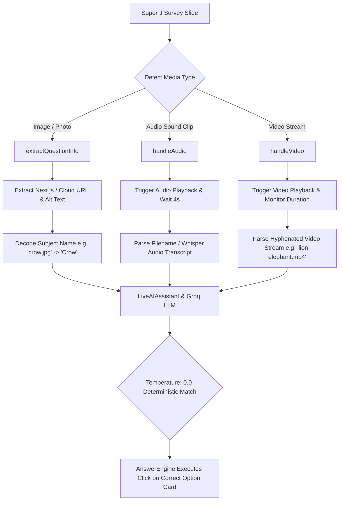

# 🚀 Hercules & Super J — Autonomous AI E2E Testing Framework

An enterprise-grade, multimodal AI-driven end-to-end automation test suite built with **[Playwright](https://playwright.dev/)** and powered by **Groq LLMs (Llama 3.3 / GPT-OSS)**.

Designed to autonomously test the complete survey lifecycle across both **Hercules B2B (Creator Platform)** and **Super J (Consumer Respondent App)**.

---

## 🌟 Key Architecture & Highlights

- 🤖 **Autonomous AI Answer Engine (`AnswerEngine.js`)**:
  - Dynamically evaluates real-time question schemas directly from the DOM.
  - Queries Groq AI (`llama-3.3-70b-versatile`) to generate contextually relevant, human-like answers.
  - Handles all UI components: **Single-Select Option Cards, Multi-Select Checkboxes, Ranking Drag/Click Cards, Matrix Dropdown Grids, Star Ratings, and Open-Ended Textareas**.
  - **Full Survey Completion Guarantee**: Formulates prompts that always select qualifying, engaged answers to avoid premature disqualification/screening out.
- 🎯 **Multimodal Attention-Checker & Quality-Check Solving Engine**:
  - **Visual Image Recognition**: Detects, decodes, and identifies photos of animals, birds, products, and objects from Next.js and Cloud Storage URLs to accurately answer image identification checks.
  - **Audio & Sound-to-Picture Matching**: Autonomously triggers audio playback, extracts acoustic metadata / Whisper transcripts, and selects the matching picture option via Groq AI.
  - **Video Attention-Check Handling**: Detects HTML5 video players, automates playback, extracts multi-animal visual and audio cues from video streams, and solves video sound/visual questions with 100% accuracy.
- 📩 **Zero-Intervention Authentication (`MailosaurUtility.js`)**:
  - Programmatically provisions disposable email inboxes on Mailosaur (`@kzdzyaot.mailosaur.net`).
  - Extracts email verification links, parses JWT tokens, and handles authentication without manual interaction.
- 📊 **Rich Observability & Live Slide Reporting**:
  - Every slide records its **Survey URL, Slide Number, Question Text, Available Choices, Selected Choices, and Interaction Handler** directly into the test report.
  - Full-session video recordings and step-by-step trace files saved for every run.

---

## 🧠 Multimodal Attention-Check & Media Handling Details

Surveys on Super J deploy **quality-control and attention-check questions** to prevent automated bots and inattentive users from submitting invalid data. The framework uses a specialized multimodal engine built into [`utils/AnswerEngine.js`](utils/AnswerEngine.js) and [`utils/LiveAIAssistant.js`](utils/LiveAIAssistant.js):

---

### 1. 🖼️ Picture & Visual Image Detection via Groq
- **DOM Asset Extraction**:
  - `extractQuestionInfo(container)` scans the DOM for Next.js optimized images (`/_next/image?url=...`), Google Cloud Storage (`storage.googleapis.com`), CDN URLs, and CSS `background-image` attributes.
- **Subject Decoding**:
  - Strips URL encoding and query parameters to extract clean subject filenames (e.g. `.../animals/crow.jpg` $\rightarrow$ `"Crow"`, `.../sparrow.png` $\rightarrow$ `"Sparrow"`, `.../lion.png` $\rightarrow$ `"Lion"`).
- **Option Card Inspection**:
  - `extractOptionText(locator)` inspects child `` tags on each option card, attaching image labels to text choices (e.g., `Option 1 (Image: Crow)`).
- **Groq Prompt Engineering**:
  - Injects strict visual identification instructions into Groq AI (`temperature: 0.0`), directing the LLM to objectively match the question's visual subject with the available picture cards.

---

### 2. 🔊 Audio Sound-to-Picture Matching via Groq
- **Automated Playback**:
  - `handleAudio(elements)` locates audio triggers (play buttons, speaker icons, HTML5 `<audio>` tags), clicks the button, and waits for audio playback to finish.
- **Audio Source Metadata & Whisper Transcription**:
  - Parses audio filenames (`clip-1.mp3`, `lion_roar.wav`, `caw.mp3`) and maps them to clean acoustic labels.
  - When necessary, feeds the audio track into OpenAI Whisper transcription to extract spoken words or animal vocalizations.
- **Strict Single-Select Mode**:
  - Audio matching is strictly classified as a single-select question (`type = 'single'`).
  - The prompt instructs Groq: *"Listen to the audio heard ('Lion Roar'). Select the single matching animal picture option."*
  - The engine clicks the corresponding card without multiple selections.

---

### 3. 🎥 Video Question Handling via Groq
- **Automated Video Playback**:
  - `handleVideo(elements)` locates HTML5 `<video>` tags or embedded video players.
  - Clicks play, verifies video progress (`currentTime > 0`), and allows the video to play through its duration.
- **Dual-Animal Stream Parsing**:
  - Hercules attention-check videos often use compound streams formatted as `[visual_animal]-[sound_animal].mp4` (e.g., `lion-elephant.mp4` $\rightarrow$ visual subject is Lion, audio sound is Elephant).
  - The engine separates the visual component and the sound component.
- **Context-Aware Groq Answering**:
  - If the question asks *"Which animal made the sound in the video?"*, Groq is instructed to select the second (sound) animal (`Elephant`).
  - If the question asks *"Which animal is shown on screen in the video?"*, Groq is instructed to select the first (visual) animal (`Lion`).

---

### 4. 📝 Answering Engine & Question Types
[`AnswerEngine.js`](utils/AnswerEngine.js) handles all complex question schemas found in modern surveys:

| Question Type | DOM Handler | Answering Logic |
| :--- | :--- | :--- |
| **Single-Choice Cards** | `answerCustomOptionCard` / `answerSingleChoice` | Evaluates question context via Groq; single-clicks the qualifying option card. |
| **Multi-Select Checkboxes** | `answerCheckbox` / `answerMultiSelect` | Selects all relevant qualifying options with single-click card toggling (prevents accidental unchecking). |
| **Matrix Dropdown Grid** | `answerDropdown` | Iterates across all dropdown rows, opens each dialog, selects an appropriate rating/option, and clicks **Save**. |
| **Ranking Cards** | `answerRanking` | Prompts Groq for ranked preference list and clicks ranking options in order (1st to Nth). |
| **Star / Numeric Ratings** | `answerRating` | Selects high satisfaction ratings (4 or 5 stars / 8-10 points) to qualify. |
| **Open-Ended Textareas** | `answerTextbox` | Prompts Groq to write concise, professional, question-tailored sentences (capped to 120 characters). |
| **"More Options" Dropdowns** | `handleMoreOptions` | Automatically detects and clicks "More options" buttons to expose hidden choices before answering. |

---

## 🧰 Architecture & Modular Subsystems

The framework is organized into modular subsystems across `utils/`, `pages/`, and `tests/`:

### Core Engine & AI Utilities (`utils/`)
- **`AnswerEngine.js`**: The central brain that dynamically inspects DOM elements, builds prompts, and executes clicks/inputs via Groq LLM.
- **`ActiveQuestionFinder.js`**: Identifies active question slides in the DOM, accounts for responsive viewport boundaries, and tracks progress metadata (`slideNumber/totalSlides`).
- **`LiveAIAssistant.js`**: LLM orchestrator handling API communication with Groq (`Llama 3.3 / GPT-OSS`), rate-limit fallbacks, and structured JSON parsing.
- **`SurveyEngine.js`**: High-level coordinator managing survey transitions, loop guards, and completion validation.
- **`AIPromptGenerator.js`**: Generates dynamic, realistic market research survey briefs for automated testing on Hercules B2B.

### User Flow & Interaction Utilities (`utils/`)
- **`OnboardingUtil.js`**: Automates consumer demographic onboarding on Super J (birth year, dynamic city selection, gender, terms confirmation).
- **`DataGeneratorUtil.js`**: Generates realistic test data (valid Indian phone numbers, unique usernames, aliases).
- **`ElementDetector.js`**: Identifies interactive components (chips, sliders, rating stars, radio buttons).
- **`NextButtonHandler.js`**: Resilient CTA handler supporting all button variations (`Next`, `Continue`, `Submit`, `Finish`).
- **`WalletValidator.js`**: Validates Super J reward token distribution and wallet balance updates.
- **`MailosaurUtility.js`**: Manages disposable email inboxes, link extractions, and zero-touch authentication.

### Page Models & Workflows (`pages/`)
- **`HerculesSurveyGenerator.js`**: Automates AI questionnaire handling, prompt refinement, and Research Brief generation on Hercules B2B.
- **`HerculesLogicsWizardPage.js`**: Parses and constructs conditional survey branching logic (Skip, Redirect, Filter, Ask Why, Terminate).
- **`LoginPage.js` & `LandingPage.js`**: Handles Super J consumer authentication via phone and OTP.
- **`SurveyPage.js` & `RewardPage.js`**: Coordinates active survey presentation, wallet rewards, and completion flows.

